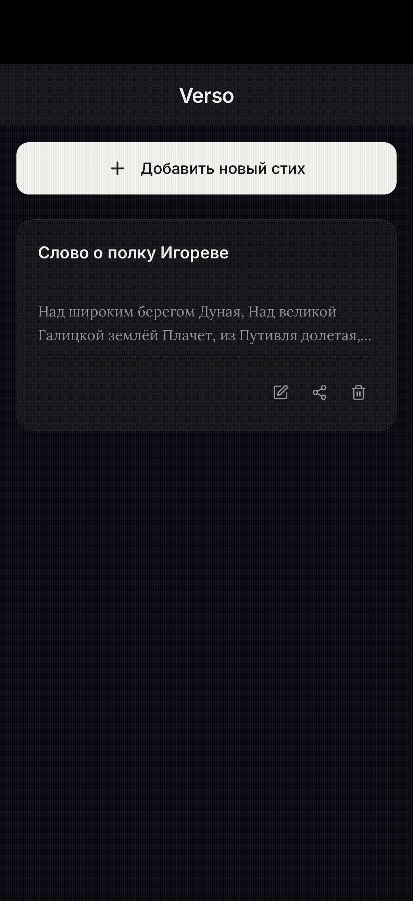
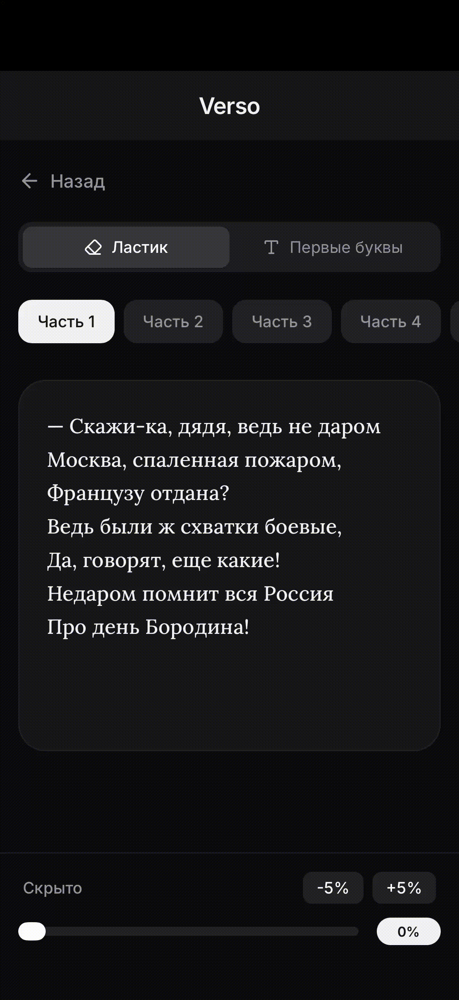

# 🖋️ Verso

**Verso** — это элегантное веб-приложение для заучивания длинных стихотворений и текстов наизусть. Оно создано с упором на премиальный, минималистичный дизайн (в духе нативных iOS-приложений) и максимальное удобство использования со смартфона.

🔗 **[Попробовать Demo на Vercel](https://verso-school.vercel.app)**

---

## 📱 Интерфейс

<div align="center">
  
  &nbsp;&nbsp;&nbsp;&nbsp;
  
</div>

---

## ✨ Идея и образ проекта
Verso превращает процесс заучивания стихов из скучной рутины в эстетически приятное занятие.
- **Дизайн:** Строгий монохром (графит и офф-вайт), аккуратные тени, выверенные отступы и размытие фона (glassmorphism).
- **Типографика:** Интерфейс приложения построен на чистом гротеске (Inter), а сами тексты стихотворений отображаются классическим книжным шрифтом с засечками (Lora) с увеличенным межстрочным интервалом, создавая ощущение чтения дорогой книги.
- **Локальность:** Приложение работает полностью в вашем браузере. База данных не требуется — все стихи хранятся в памяти вашего устройства (`localStorage`).

## 🚀 Основные возможности

### 📚 Библиотека стихов
Все ваши тексты надежно сохраняются в приложении. На главном экране вы видите удобную сетку карточек со стихами. Вы можете в любой момент отредактировать текст, изменить название или удалить стих из библиотеки.

### 📷 Умное добавление через фото (OCR)
Вам не обязательно перепечатывать длинные стихи вручную! Verso использует технологию нейросетевого распознавания текста (Tesseract.js). Достаточно сделать фото страницы из книги, приложение обработает изображение (улучшит контрастность) и автоматически переведет картинку в текст.

### 🧠 Режимы тренировки памяти
Verso предоставляет два уникальных алгоритма для запоминания:
1. **Ластик:** Приложение плавно стирает случайные слова из текста, оставляя вместо них пустые подчеркивания. Чем дальше вы двигаете ползунок сложности, тем меньше слов остается на экране.
2. **Первые буквы:** Приложение заменяет каждое слово на его первую букву. Это идеальная подсказка для мозга, когда вы уже почти выучили стих, но иногда запинаетесь на начале строчек.
*(Оба режима бережно сохраняют оригинальную пунктуацию и переносы строк).*

### 🎛️ Гибкая настройка сложности
В режиме тренировки внизу экрана закреплена удобная панель управления (slider). Вы можете тянуть ползунок от 0% до 100% или использовать кнопки **-5%** и **+5%** для точной регулировки того, насколько сильно скрыт текст. 

### 🧩 Работа по частям
Стихотворение автоматически разбивается на смысловые части (строфы) по пустым строкам. Вы можете учить стихотворение по одной строфе, либо нажимать на кнопки частей как на переключатели, объединяя несколько кусков текста воедино. Также есть кнопка "Выбрать все" для генеральной репетиции.

### 🔗 Шеринг без серверов
Вы можете поделиться любым стихом с друзьями одним нажатием кнопки. Verso сжимает весь текст стихотворения в специальную короткую ссылку с помощью `lz-string`. Когда ваш друг открывает эту ссылку, приложение моментально распаковывает стих прямо у него в браузере и добавляет в его личную библиотеку. 

---

## 🛠️ Технологический стек
- **Frontend:** React + Vite
- **Стилизация:** Tailwind CSS v4 (без конфигурационных файлов)
- **Распознавание текста:** Tesseract.js (модель `rus` / `tessdata_best` + Canvas API для препроцессинга)
- **Алгоритмы и шеринг:** RegEx для токенизации, `lz-string` для LZ-сжатия данных в URL.
- **Иконки:** `lucide-react`

## 📦 Как запустить локально

1. Убедитесь, что у вас установлен Node.js.
2. Установите зависимости проекта:
   ```bash
   npm install
   ```
3. Запустите сервер для разработки:
   ```bash
   npm run dev
   ```
4. Откройте `http://localhost:5173` в вашем браузере.

---
*Сделано для тех, кто ценит красоту слова и чистоту интерфейса.*
